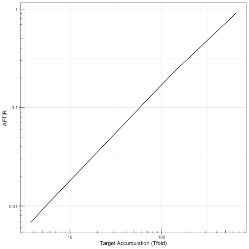

# Preliminary stuff


```r
# Need this to get rxode working. I don't know why I keep having to run this.
Sys.setenv(PATH = paste(Sys.getenv("PATH"), "C:/RBuildTools/3.4/bin/",
            "C:/RBuildTools/3.4/mingw_64/bin", sep = ";"))
Sys.setenv(BINPREF = "C:/RBuildTools/3.4/mingw_64/bin/")

# To be called at the top of every Rmd file. Initialization code and some useful constants.
suppressMessages(source("ams_initialize_script.R"))
```

# Individual sensitivity analysis


```r
# Load model and parameters.
model           = ivsc_4cmtct_shedct()
drugs           = c("Atezolizumab", "Trastuzumab", "Pembrolizumab", "Bevacizumab"); paths = NULL; i = 4
paths[i]        = paste0("../data/ModelF_", drugs[i],"_Params.xlsx")
param.as.double = read.param.file(paths[i])
param.as.double["keS3"] = 1
df_param        = as.data.frame(t(param.as.double))
dose.nmol       = scale.mpk2nmol

# Soluble parameters require different treatment.
soluble = "Bevacizumab"
if (drugs[i] %in% soluble) {
  isSoluble = TRUE
  } else {
  isSoluble = FALSE
}

# Set parameter of interest and range for SA.
dose.nmol.range = lseq(.1,10,7)*scale.mpk2nmol
param.to.change = 'keS3'
param.to.change.range = lseq(as.numeric(df_param[param.to.change])*.001,   
                             as.numeric(df_param[param.to.change])*1000, 
                             7)

# Dose time, frequency, compartment
tmax = 26*7 #days
tau  = 21   #days
compartment = 2

# Create data frame containing variables of interest for chaning parameter of interest.
df_compare = compare.thy.sim(model = model,
                             param.as.double = param.as.double,
                             dose.nmol = dose.nmol,
                             tmax = tmax,
                             tau  = tau,
                             compartment = compartment,
                             param.to.change = param.to.change,
                             param.to.change.range = param.to.change.range,
                             soluble = isSoluble)
df_compare = df_compare %>% mutate(drug = drugs[i], isSol = isSoluble)

# Retrieve simulation and theory only for individual plotting.
df_sim = subset(df_compare, type=='simulation')
df_thy = subset(df_compare, type=='theory')

# Plot.
ggplot(df_sim, aes(x=Tacc.tum, y=AFIRT.sim)) + 
  geom_line() + 
  scale.x.log10() +
  scale.y.log10() +
  # scale.y.log10(limits=c(10^-4, 10^4)) +
  # labs(x=param.to.change, y='AFIRT')
  labs(x='Target Accumulation (Tfold)', y='AFTIR')
```



```r
ggsave("../results/Task04_Taccum.pdf",width = 4,height=3)
```


