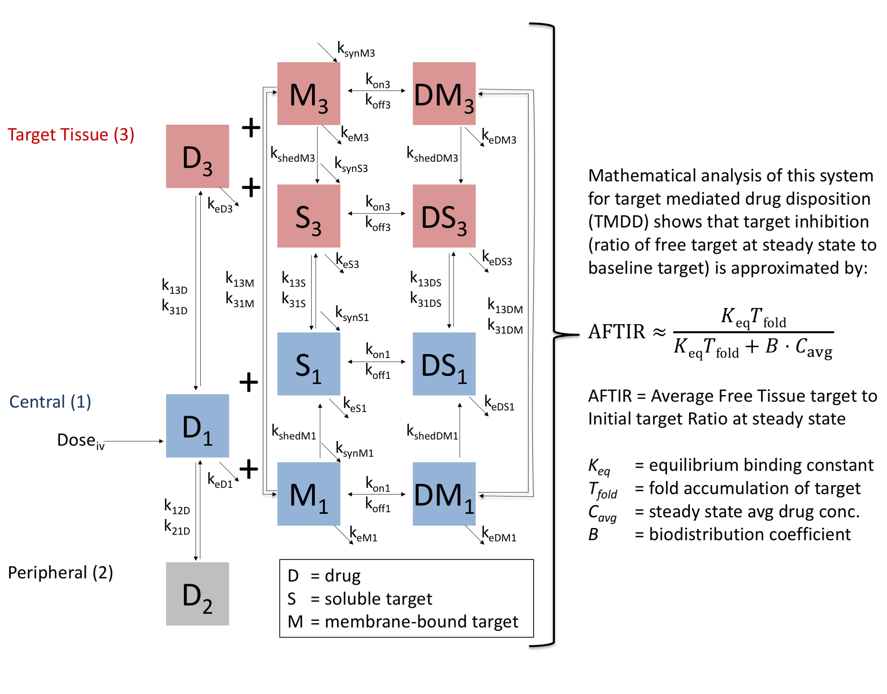

This repository contains the code for the following paper:
[Guiding dose selection of monoclonal antibodies using a new parameter (AFTIR) for characterizing ligand binding systems](https://www.biorxiv.org/content/early/2018/10/17/432500)

## Parameter Files
The parameter files are stored in the data directory and are called "ModelF_DRUG.xlsx" where DRUG can be Atezolizumab, Bevacizumab, Pembrolizumab, or Trastuzumab.

## Key R Scripts and Rmarkdown files
These are short Tasks in Rmarkdown or R for generating key figures for the manuscript.
They are stored in the ModelF folder.
- Task10  - illustrates some simple graphs for how code can be executed
- Task09f - Varying dose and checking AFTIR for each drug
- Task09dV2 - comparison of simple formulation of AFTIR to the full formulation of AFTIR
- Task05e - Varying other parameters and checking AFTIR accuracy for each drug
- Task04  - look at how changing target accumulation affects AFTIR

## Key helper files and functions
These contain the key functions that are called by multiple scripts above.  They are also located in the ModelF folder.
- AFIRT_calculation.R
  -	read.param.file() = read parameter file from Excel
  -	lumped.parameters.theory() = calculates AFTIR from theory
  -	lumped parameters.simulation() = calculates AFTIR from simulation
  -	simulation() - simulates model for one set of parmeters
-	ams_graphics_v2.R - Contains some useful graphics functions
  -	scale.x.log10(), scale.y.log10() - for properly labeling log scaling
-	ams_initialize_scrpt.R - To be called at the top of every Rmd file.  Initialization code and some useful constants.
-	ams_tmdd_helper.R - Could potentially be helpful for doing sensitivity analysis.
-	ivsc_4cmtc_shedct.R - ODE for Model F, written to work with RxODE

## Graphical Abstract

